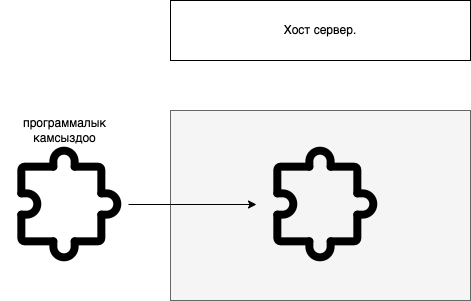
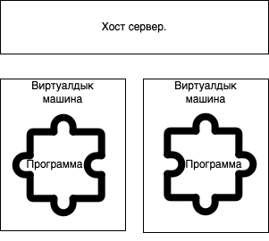

Саламатсызбы, биринчи бөлүмгө кош келиңиз контейнерлерге болгон саякатыбыз, анда биз негиздерин талкуулайбыз контейнер технологиясы.

## Контейнерлер бул деген эмне?

Контейнерлер портативдик программалык камсыздоо. Алар программалык камсыздооңузду ар кандай системаларда ишенимдүү иштетүүгө мүмкүндүк берген технология.
Ошентип, биз иштеп чыгуу системасы, тест системасы, продакшн системасы, жада калса иштеп чыгуучунун ноутбуку жөнүндө сөз кылып жатабызбы, биз программалык 
камсыздоонун ишенимдүү жана ырааттуу иштешин каалайбыз. Кандай системада экенине карабастан, контейнерлер бизге муну кылууга мүмкүндүк берет. Эгерде биз 
программалык камсыздообузду портативдик режимде бир нече түрдүү системаларда иштете алсак, бул өнүгүүнү тездетет, автоматташтырууну жөнөкөйлөтөт
жана биздин код бардык жерде, ошондой эле өндүрүштө ырааттуу иштешин камсыздайт.

Сиз виртуалдык машиналар түшүнүгү менен тааныш болушуңуз мүмкүн. Контейнерлер берген пайдалары жагынан виртуалдык машиналарга абдан окшош. Виртуалдык 
машиналар сиздин программаңызды стандартташтырылган чөйрөгө ороп алат бул ар кандай чөйрөдө ырааттуу иштөөгө мүмкүндүк берет жана контейнерлер 
дээрлик бирдей нерсени аткарат. Бирок контейнерлер муну виртуалдык машиналарга караганда кичинекей, ресурстарды азыраак колдонгон жана автоматташтыруу 
оңой болгон виртуалдык машиналарга караганда башкача кылат.

Биз көптөгөн техникалык деталдарга кирбейбиз, бирок мен сизге виртуалдык машиналардан айырмаланып, контейнерлер муну кантип жасаары жөнүндө жалпы 
түшүнүк бергим келет. 3,196 / 5,000
Translation results
Ошентип, адегенде бизде жылаңач металл орнотуу бар, бул жөн гана физикалык серверге кандайдыр бир программаны орнотууну билдирет. 
Бизде хост-сервер бар жана биз программалык камсыздообузду орнотуп жатабыз жана мен ал жерде программалык камсыздоону көрсөтүү үчүн 
паззлдын кичинекей сүрөтчөсүн колдондум, анткени паззлдын бөлүгү кызыктай формада жана ал программаны машинада, машинада иштеши үчүн 
программалык камсыздоону ийгиликтүү иштетүү жана орнотуу үчүн белгилүү бир жол менен конфигурацияланышы керек.

Башкача айтканда, сиздин хост сервериңиз ошол программаны иштетүү үчүн ылайыкташтырылган. Жана бул, эгерде сиз ошол программаны башка серверде же башка чөйрөдө 
иштеткиңиз келсе, ал башка чөйрө да ушундай эле ыңгайлаштырылган болушу керек дегенди билдирет. Ошентип, татаалдык көп жана ал программаны ар кандай системаларда
иштетүү процессин автоматташтыруу абдан кыйын. Виртуалдык машиналар бул көйгөйдү программалык камсыздоону ороп чечет
виртуалдык машинада. Ошентип, сизде хост сервериңиз бар, анан сизде виртуалдык машиналарыңыз бар, алар сиздин программалык камсыздооңуздун иштөөсү үчүн виртуалдык 
сервер катары иштейт жана бул программаны иштетүү үчүн хост серверин конкреттүү түрдө конфигурациялоону талап кылбайт.
Виртуалдык машина гана жайгаштырууга жөндөмдүү болушу керек программалык камсыздоо. Ал эми контейнерлер негизинен ошол эле нерсени аткарышат, бирок мен бул жерде 
программалык камсыздоого салыштырмалуу контейнердин сүрөтчөлөрүн кичине кылып койгонумду байкайсыз.

Алар программалык камсыздоонун айланасына бекем ороп коюшат. Программаны жайгаштыруу үчүн кошумча чыгымдар азыраак.

Мен ошондой эле кошумча чыгымдын азайышынан улам, сиз бир хост серверине көбүрөөк контейнерлерди батыра аласыз.
VM менен салыштырганда окшош өлчөмдө. Андыктан, келгиле, эмне үчүн бул тууралуу кыскача сүйлөшөлү. 
Ошентип, менде сол жакта виртуалдык машиналар бар, ал эми виртуалдык машинанын иштөө жолу - менин хостумдун операциялык 
тутумум бар. Мисалы, менде Linux серверим бар, анда менин хостумдун операциялык системасы Linux операциялык системасы. 
Ал эми виртуалдык машина программалык камсыздоонун айланасында толук өзүнчө кошумча операциялык системанын толук көчүрмөсүн камтыйт. 
Ошентип, ал виртуалдык машинанын өзүнүн толук операциялык системасы бар жана бул виртуалдык машиналар тарткан кошумча чыгымдарды киргизет.

Контейнерлер менен сизде хост операциялык тутуму бар, бирок акырында контейнерлер түздөн-түз ошол хост операциялык тутумунда иштейт.
Аларда программалык камсыздоону жайгаштыруу үчүн контейнердин ичинде камтылган бир нече кошумча компоненттер болушу мүмкүн, 
бирок иштөө үчүн аларга өздөрүнүн операциялык тутумунун толук, толук көчүрмөсү керек эмес. Бул аларды виртуалдык машиналарга 
караганда ылдамыраак, кичирээк жана жеңил кылат, демек, бир хостко көбүрөөк контейнерлерди батыра аласыз, бул жеткиликтүү ресурстарды 
натыйжалуураак колдонууга алып келет. Ошентип, бул сабакта биз эмне жөнүндө сөз кылганыбызды кайталоо үчүн, контейнерлер VMлер сыяктуу 
эле көчмө жана ырааттуулукту сунуштайт, бирок кичине, тезирээк жана жеңилирээк, анткени ар бири үчүн операциялык системанын толук көчүрмөсү 
керек эмес. контейнер. Ошентип, мен сизге контейнерлер деген эмне жана алар эмне кылышы жөнүндө негизги түшүнүк бергенден кийин, сиз
улантууга жана контейнерлер сизге чыныгы бизнес баасын жеткирүүгө кандайча жардам берерин үйрөнүүгө даярсыз.
